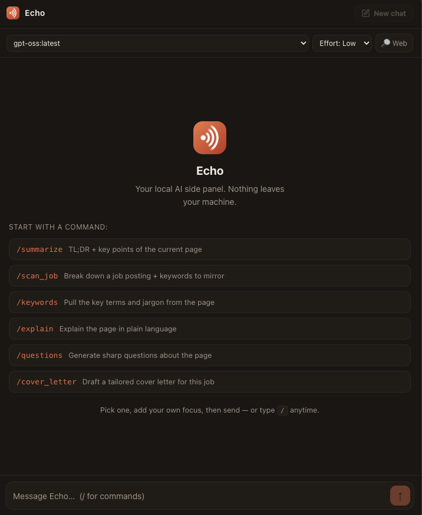
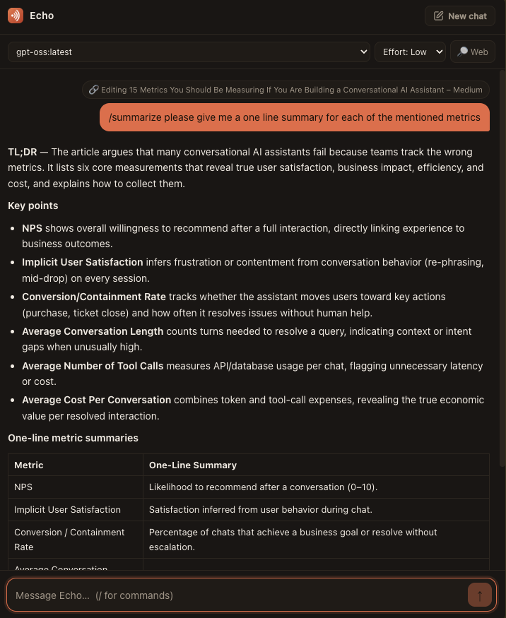
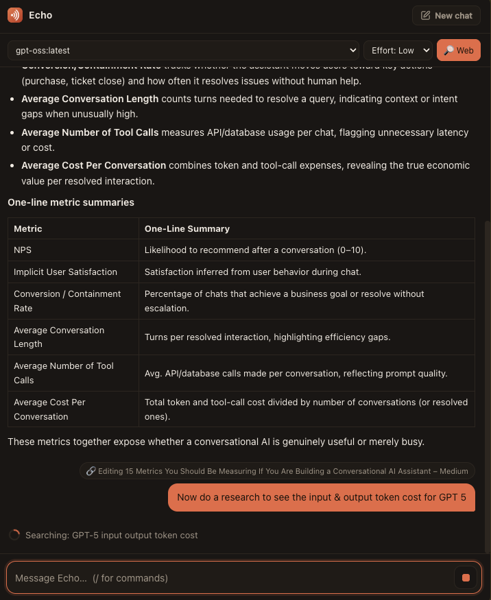
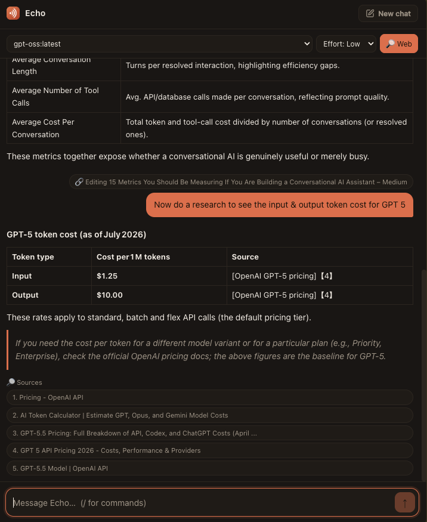
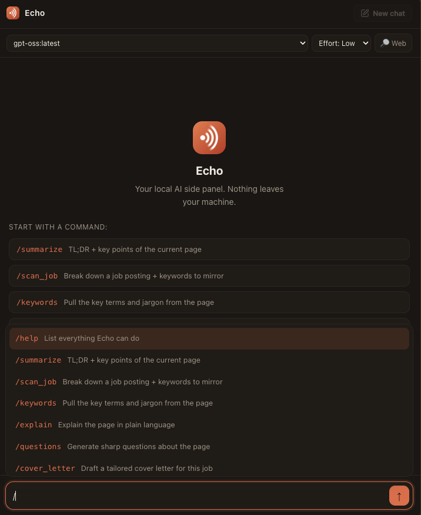

# Echo

**A Chrome side panel AI assistant that runs entirely on your local Ollama — no
API keys, no per-token bills, no data leaving your machine.**

Echo is always aware of the page you're on. Ask it a question, or reach for a
slash command to summarize an article, break down a job posting, or draft a
cover letter — all answered by a model running on your own hardware.

<p align="center">
  
  
</p>

## Why Echo?

- **Free to run, forever.** No API key, no subscription, no metered usage —
  just Ollama and your CPU/GPU.
- **Private by default.** Every request goes to `localhost:11434`. The only
  thing that ever leaves your machine is a DuckDuckGo query, and only if you
  turn on Web search and the model decides it needs one.
- **Page-aware by default.** This isn't a generic chatbot bolted onto a
  sidebar — the current tab's content is attached to every message, so "what
  does this mean?" just works without extra setup.
- **Built to be extended.** Commands are plain data (name, hint, prompt) in
  one file. Adding a new one is a five-minute PR — see [Contributing](#contributing).

## Quick start

```bash
git clone https://github.com/<your-username>/echo.git
cd echo
npm install
npm run build
```

Then in Chrome:

1. Open `chrome://extensions`, enable **Developer mode**
2. **Load unpacked** → select the `dist/` folder
3. Click the Echo toolbar icon to open the side panel

**One gotcha before it'll talk to Ollama:** Ollama rejects requests from a
`chrome-extension://` origin by default. Grab your extension's ID from
`chrome://extensions` and allow it:

```bash
# macOS (menubar app) — then quit and reopen Ollama
launchctl setenv OLLAMA_ORIGINS "chrome-extension://<EXTENSION_ID>"
```

That fix resets on every reboot. On macOS, run
`./scripts/persist-ollama-origins-macos.sh <EXTENSION_ID>` instead to make it
permanent — see [Ollama CORS setup](#ollama-cors-setup) below for details, and
for Linux/Windows, which persist by default.
running Ollama manually instead of as a service.

**Dev loop:** after any code change, `npm run build`, then click the ⟳ reload
icon on the Echo card in `chrome://extensions`. An extension loads from the
built `dist/` folder, not the Vite dev server, so `npm run dev` alone won't
update what's loaded in Chrome.

## Features

- Docked side panel that opens on toolbar-icon click (`chrome.sidePanel`)
- Model picker populated from Ollama's `/api/tags`
- Streaming chat via `/api/chat` (tokens render as they arrive) with a Stop button
- **The current tab's content is always attached to chat**, not just to slash
  commands. The model is told to use the page only when the question is
  actually about it, and to answer normally otherwise (general knowledge,
  math, etc). Falls back to plain chat if the page can't be read (a
  `chrome://` tab, no active tab, etc.)
- **Model / effort / web** controls in the toolbar:
  - pick any installed model
  - **effort** (Low / Med / High) maps to Ollama's `think` reasoning level, and is
    auto-disabled for models that don't support thinking
  - **🔎 Web** toggle exposes a `web_search` tool to the model; it calls it (a
    DuckDuckGo query) only when it decides the answer needs current facts, then
    cites sources as `[n]`. Off by default, and disabled for models that can't
    call tools

  <p align="center">
    
    
  </p>

- **Slash commands** (type `/` in the box) that act on the current tab's text via
  `chrome.scripting`. Selecting a command inserts it and waits so you can add your
  own focus (e.g. `/summarize in one sentence`) before sending:
  - `/summarize` — TL;DR + key points
  - `/scan_job` — break down a job posting + keywords to mirror
  - `/keywords` — pull key terms and jargon
  - `/explain` — plain-language explanation
  - `/questions` — sharp questions (interview Qs for job posts)
  - `/cover_letter` — tailored cover-letter draft
  - `/help`, `/clear` — utilities

  <p align="center">
    
  </p>

- Markdown rendering (sanitized), warm "Terracotta" theme, light/dark following
  your OS's `prefers-color-scheme` automatically

## Contributing

PRs welcome — adding a new slash command is the easiest and most useful way to
contribute. Commands live in [src/sidepanel/commands.js](src/sidepanel/commands.js)
as plain data, not one-off handlers:

```js
{
  name: 'eli5',
  hint: 'Explain the page like I\'m five',
  needsPage: true,
  instruction:
    'Explain the page below as if to a curious ten-year-old: short sentences, ' +
    'concrete analogies, no jargon.\n\n' +
    'Keep it under ~120 words.',
}
```

Drop that into the `COMMANDS` array and it's automatically wired into `/help`,
the `/` autocomplete palette, and the featured chips on the empty state — no
other file needs to change. A few conventions to follow:

- Give the model an explicit output shape (headings, bullet count, word cap) —
  local models drift without one.
- State a grounding rule ("use only the page content", "say so if it's not
  there") so the command doesn't hallucinate.
- Keep instructions short and direct; the shared `SYSTEM_PROMPT` already
  covers formatting and grounding, so don't repeat it.

For anything bigger (new tool integrations, UI changes), open an issue first
to talk through the approach before sending a large PR.

## Privacy

By default everything runs against your local Ollama and nothing leaves your
machine. The **one exception** is the **🔎 Web** toggle: when it's on, the model is
given a `web_search` tool and may choose to call it — and only when it does is a
query sent to DuckDuckGo. It's off by default, so nothing is sent unless you opt in
and the model actually decides a search is warranted.

## Ollama CORS setup

Ollama rejects requests from a `chrome-extension://` origin by default, so you must
add Echo's origin to `OLLAMA_ORIGINS`. Allow **only this extension** rather than all
extensions (`chrome-extension://*`).

Find your ID at `chrome://extensions` (it's stable once installed) and use it below
in place of `<EXTENSION_ID>`. **Restart Ollama after setting the variable.**

<details open>
<summary><b>macOS</b></summary>

If you run the **menubar app**, the quick fix only lasts until your next
reboot/logout — `launchctl setenv` doesn't persist:

```bash
launchctl setenv OLLAMA_ORIGINS "chrome-extension://<EXTENSION_ID>"
# then quit Ollama from the menubar and reopen it
```

**For a permanent fix that survives reboots**, run the setup script in this
repo instead. It installs a LaunchAgent that reapplies the setting (and
restarts Ollama if needed) on every login:

```bash
./scripts/persist-ollama-origins-macos.sh <EXTENSION_ID>
```

To remove it later, the script prints the exact `launchctl unload` + `rm`
command for its own plist.

If you run Ollama **manually** in a terminal instead of the menubar app:

```bash
OLLAMA_ORIGINS="chrome-extension://<EXTENSION_ID>" ollama serve
```
</details>

<details>
<summary><b>Linux</b></summary>

If Ollama runs as a **systemd service** (the default from the install script):

```bash
sudo systemctl edit ollama.service
```

Add these lines, save, then reload and restart:

```ini
[Service]
Environment="OLLAMA_ORIGINS=chrome-extension://<EXTENSION_ID>"
```

```bash
sudo systemctl daemon-reload
sudo systemctl restart ollama
```

If you run it **manually**:

```bash
OLLAMA_ORIGINS="chrome-extension://<EXTENSION_ID>" ollama serve
```
</details>

<details>
<summary><b>Windows</b></summary>

**PowerShell** — persist for your user account, then restart Ollama from the tray:

```powershell
setx OLLAMA_ORIGINS "chrome-extension://<EXTENSION_ID>"
```

Or set it for the **current session only** (manual run):

```powershell
$env:OLLAMA_ORIGINS = "chrome-extension://<EXTENSION_ID>"
ollama serve
```

Or via the GUI: **Settings → System → About → Advanced system settings →
Environment Variables**, add a user variable `OLLAMA_ORIGINS` with the value
`chrome-extension://<EXTENSION_ID>`, then quit and reopen Ollama.
</details>

## Project layout

```
public/
  manifest.json        # hand-written MV3 manifest (copied to dist/ root by Vite)
  service-worker.js    # background worker: opens the panel on icon click
  icons/               # generated PNG icons
sidepanel.html         # panel entry (Vite input in vite.config.js)
src/sidepanel/
  main.jsx             # mounts React
  SidePanel.jsx        # app shell: model load, streaming, page actions, autoscroll
  Composer.jsx         # auto-growing input + slash-command palette
  Message.jsx          # user bubble / assistant markdown / typing indicator
  EmptyState.jsx       # hero + featured commands
  ollama.js            # getModels() + getCapabilities() + streamChat() (NDJSON)
  page.js              # getPageContent() via chrome.scripting
  websearch.js         # keyless DuckDuckGo search + result formatting
  commands.js          # command registry + engineered prompts + system prompt
  markdown.js          # marked + DOMPurify
  sidepanel.css        # design tokens + all styles (light/dark)
```

### Why `base: './'`

Vite defaults to absolute asset paths (`/assets/...`). Inside a packaged extension
the HTML is served from `chrome-extension://<id>/`, so `base: './'` emits relative
paths that resolve correctly.

## License

[MIT](LICENSE) — use it, fork it, ship it.
